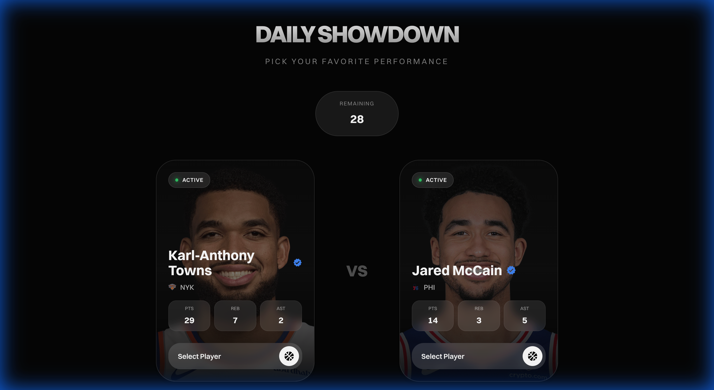

# 🏀 NBA Daily Showdown

**The ultimate daily NBA player showdown game where YOU decide who had the best performance!**



## 🎮 What Is This?

Ever argue with your friends about who had the better game? Well, now you can settle it yourself! NBA Daily Showdown is a fast-paced, addictive game that lets you compare real NBA player performances from recent games and pick your favorites until only one remains standing.

Think of it as "Hot or Not" meets NBA stats, with a twist of March Madness bracket energy. 🔥

## ✨ How It Works

1. **The Setup**: We grab real box scores from recent NBA games using the official NBA API
2. **The Showdown**: Two players face off. You pick who had the better night (based on vibes, stats, or pure bias—we don't judge!)
3. **The Twist**: Your chosen player gets thrown BACK into the deck to potentially face off again
4. **The Grind**: Keep picking until you've narrowed down the entire field
5. **The Crown**: The last player standing becomes YOUR "Player of the Day" 👑

## 🎯 Features

- **Real NBA Data**: Live stats from actual games via `nba_api`
- **Beautiful Cards**: Glassmorphic design with player headshots and team logos
- **Smooth Animations**: Powered by Framer Motion for that premium feel
- **No Wrong Answers**: This is YOUR opinion. Pick based on stats, loyalty, or just vibes
- **Recycling System**: Players you pick go back into the deck for potential rematches
- **Daily Fresh Content**: New games = new showdowns every day
- **Expanded Stats**: Full box score stats with color coding (green = above avg, red = below)
- **Game Score**: Performance rating for every player based on weighted stats
- **Match History**: Path to Victory log tracking every matchup your winner survived
- **Team Filter**: Filter players by team with a dynamic dropdown
- **Date Picker**: Play historical showdowns from any date in the season
- **Share Winner**: Share your Player of the Day via native share or clipboard
- **PWA**: Install on mobile, offline-capable with cached assets
- **Smart Caching**: 30-min TTL cache so repeat visits load instantly
- **Resume Game**: Game state saved to localStorage — refresh without losing progress

## 🛠️ Tech Stack

### Frontend
- **React** + **Vite** - Lightning-fast development
- **Framer Motion** - Buttery smooth animations
- **React Icons** - Clean, crisp icons
- **Custom CSS** - Glassmorphism and dark mode aesthetics

### Backend
- **FastAPI** - Python backend that's faster than a LaMelo Ball fastbreak
- **NBA CDN** - Real-time stats from `cdn.nba.com` (works from any server)
- **Concurrent Fetching** - ThreadPoolExecutor for parallel box score loading
- **CORS Middleware** - So frontend and backend can be friends

## 🚀 Getting Started

### Prerequisites
- **Node.js** (v16+)
- **Python** (3.8+)
- A love for basketball (required)

### Installation

#### 1. Clone the repo
```bash
git clone https://github.com/Paristech1/NBAshowdown.git
cd NBAshowdown
```

#### 2. Backend Setup
```bash
cd backend
python -m venv venv
source venv/bin/activate  # On Windows: venv\Scripts\activate
pip install -r requirements.txt  # fastapi, uvicorn, requests
uvicorn main:app --reload --port 8000
```

#### 3. Frontend Setup
```bash
cd frontend
npm install
npm run dev
```

#### 4. Open Your Browser
Navigate to `http://localhost:5173` and start the showdown! 🏀

## 🔧 Environment Variables

| Variable | Default | Description |
|---|---|---|
| `ALLOWED_ORIGINS` | `http://localhost:5173,http://localhost:3000` | Comma-separated list of allowed CORS origins for the backend |

Set environment variables before starting the backend:
```bash
export ALLOWED_ORIGINS="http://localhost:5173,https://yourdomain.com"
```

## 🎨 Design Philosophy

We wanted this to feel **premium**. No basic MVP vibes here. Think:
- **Dark mode by default** (because we're not savages)
- **Glassmorphism** (it's 2024, we fancy now)
- **Smooth animations** (every click should feel satisfying)
- **Real player photos** (no placeholder silhouettes)
- **Team logos** (rep your squad)

## 🏆 Game Strategy Tips

- **Stats Don't Lie**: Check PTS, REB, AST before you pick
- **Trust Your Gut**: Sometimes a 15/8/6 just hits different
- **Loyalty Matters**: It's okay to pick your favorite player every time
- **The Grind**: Players can reappear, so you might have to choose between the same two players multiple times!

## 🔮 Future Ideas

- [ ] **User/Admin Login System** - Create accounts and track your history
- [ ] **Database Integration** - Save each user's "Player of the Day" picks
- [ ] Head-to-head mode (challenge your friends)
- [ ] Season-long leaderboards
- [ ] Advanced stats (PER, TS%, +/-)
- [ ] Player comparison history
- [ ] Playoff mode with elimination brackets

## 🤝 Contributing

Got ideas? Found a bug? Want to add a feature? PRs are welcome! This is a fun project, so let's keep it fun.

## 📝 License

MIT License - Do whatever you want with it, just don't blame me if you get too addicted 😅

## 🙏 Acknowledgments

- **NBA API** for the data
- **Every NBA player** for giving us something to argue about
- **Basketball fans everywhere** who understand the importance of these debates

---

**Built with 🏀 by [Paris](https://github.com/Paristech1)**

*"Ball is life, but this app is pretty close."*
